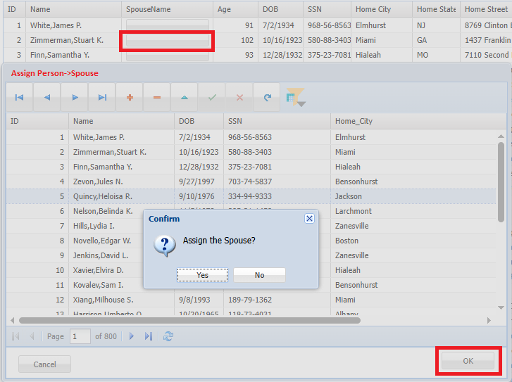
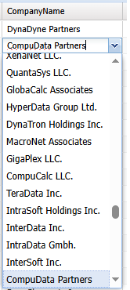
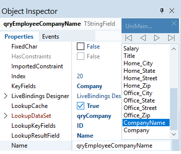
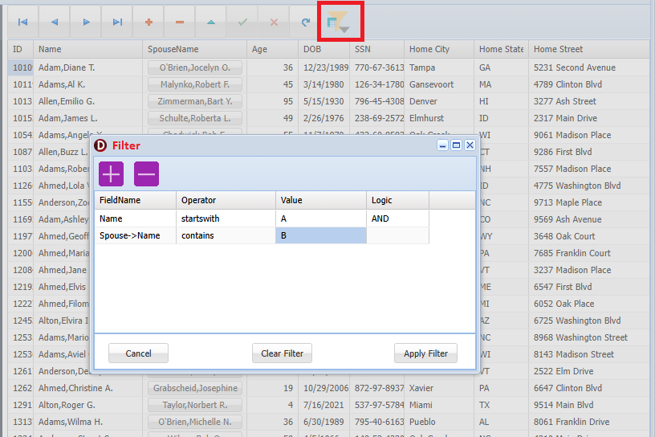
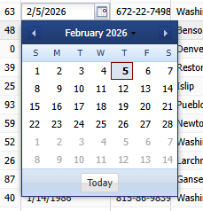

<h1>IrisWebClient</h1>

<b>Rich GUI web application for the InterSystems IRIS database</b>

A modern web client built with <b>Delphi + uniGUI</b> and connected to 
<b>InterSystems IRIS</b> via <b>ODBC</b>.  
The application demonstrates full <b>CRUD operations</b>, referential property handling, 
and IRIS-native filtering using implicit JOINs.

<h2>How to Test</h2>

<b>If you want to test the app without installing anything:</b>

<a href="https://demo.irisclient.org">https://demo.irisclient.org</a>

 
Login: demo 
Password: demo

<h2>Features</h2>
<ul>
  <li><b>Cross‑Platform Deployment</b></li>
  <ul>
    <li>Windows: Service, Standalone EXE, ISAPI.</li>
    <li>Linux: Standalone executable or Apache module.</li>
    <li>Linux 64‑bit builds compiled via Delphi FireMonkey.</li>
  </ul>
  <li><b>Full CRUD</b> (Create, Read, Update, Delete) for IRIS persistent classes</li>
  <li><b>Insert/update referential properties</b> such as:
    <ul>
      <li>Person → Spouse</li>
      <li>Employee → Company</li>
    </ul>
  </li>
  <li><b>IRIS implicit JOIN filtering:</b>:
    <ul>
      <li>Filter by nested referential fields.</li>
      <li>Examples:
        <ul>
          <li>Person.Spouse.Name</li>
          <li>Employee.Company.Name</li>
          <li>Address.City</li>
        </ul>
      </li>
    </ul>
  </li>
  <li>Rich web UI built with uniGUI.</li>
  <li>ODBC connectivity for SQL access to IRIS.</li>
  <li>Zero‑installation browser client.</li>
</ul>

<h2>Architecture Overview</h2>
<ul>
  <li><b>Frontend:</b> uniGUI (Delphi)   https://unigui.com/ </li>
  <li><b>Backend:</b> InterSystems IRIS   https://www.intersystems.com/</li>
  <li><b>Connectivity:</b> IRIS ODBC driver, used over standard FireDAC data access library in Delphi</li>
  <li><b>Data Model:</b> Person, Employee, Company, Address (with referential relationships)   
  <a href="https://openexchange.intersystems.com/package/ObjectScript-Native-API-demo"><b>ObjectScript-Native-API-demo</b></a>
  </li> 
</ul>

<h2>CRUD Demonstration</h2>

The application implements full CRUD for all major entities:

<table>
  <tr>
    <th>Entity</th>
    <th>Create</th>
    <th>Read</th>
    <th>Update</th>
    <th>Delete</th>
    <th>Referential Fields</th>
  </tr>
  <tr>
    <td>Person</td>
    <td>✔</td>
    <td>✔</td>
    <td>✔</td>
    <td>✔</td>
    <td>Spouse, Address</td>
  </tr>
  <tr>
    <td>Employee</td>
    <td>✔</td>
    <td>✔</td>
    <td>✔</td>
    <td>✔</td>
    <td>Company</td>
  </tr>
  <tr>
    <td>Company</td>
    <td>✔</td>
    <td>✔</td>
    <td>✔</td>
    <td>✔</td>
    <td>—</td>
  </tr>
</table>

<h2>Referential Property Handling</h2>

The application demonstrates how to:

<ul>
  <li>Insert and update objects with references.</li>
  <li>Display referential fields in grids.</li>
  <li>Resolve nested properties (e.g., Person.Spouse.Name).</li>
  <li>Maintain referential integrity through UI controls.</li>
</ul>

<h2>Filtering with IRIS Implicit JOIN</h2>

IRIS automatically resolves referential properties in SQL queries.  
This application shows how to filter by nested properties without writing explicit JOINs.

<pre><code>
SELECT * FROM ONAPI.Person WHERE Spouse->Name LIKE 'A%'
</pre></code>

<h2>Installation on Windows host</h2>
<ul>
  <li>Install IRIS</li>
  <li>Load sample classes to IRIS 
  use <a href="https://openexchange.intersystems.com/package/ObjectScript-Native-API-demo"><b>ObjectScript-Native-API-demo</b></a>   
  <pre><code>git clone https://github.com/r-cemper/ObjectScript-Native-API.git</code></pre>
  load classes
  <pre><code>
  USER>do $system.OBJ.LoadDir("...\ObjectScript-Native-API\src\ONAPI","ck")
  </code></pre>Run the database installation. This is an interactive process; you will be asked how many Persons, Employees, and Companies to create. 
  <pre><code>USER>do ##class(ONAPI.demo).Run()</code></pre>
  </li>
  <li>Configure ODBC DSN 
  Create a 'User DSN' for InterSystems IRIS ODBC driver
  </li>  
  <li>Build the uniGUI IrisWebClient.exe application in Delphi 
	Delphi 12 CE was used to create this aplication, but the application should build </>
	with no problems on any modern Delphi version since uniGUI is only third-party dependency,  
	but indeed the breakthrough technology.
  </li>
  
  <li>Update connection.ini with ODBC connection parameters and make sure the file is located in the same directory as IrisWebClient.exe
  <pre><code>  DataSource=...
  User_Name=...
  Password=...
  ODBCDriver=InterSystems IRIS ODBC35
  Database=...
  DriverID=ODBC</code></pre> 
  </li>
  <li>Make sure login.html  is located in the same directory as IrisWebClient.exe.</li>
  <li>Run IrisWebClient.exe and navigate your browser to the default address and port:   
  http://localhost:8077</li>
  
</ul>

<h2>Screenshots</h2>

<b>Main Dashboard</b>
 

Use implicit JOIN to select referential fields.

<pre><code>SELECT *, Spouse->Name AS SpouseName FROM ONAPI.Person
</code></pre>

This works perfectly fine with FireDAC over IRIS ODBC.

<b>IRIS ODBC does accept object‑projection syntax (->) when the SQL is passed through FireDAC unchanged</b>

 

<b>Assigning referential properties</b>
 

Select a Person, click button in SpouseName column, select a Spouse, click 'OK' to confirm assignment
 

Implementation using ODBC layer as FireDAC dataset. Assign referetial field with reference ID and do Post.

<pre><code> 
    FTargetDataSet.Edit;
    FTargetDataSet['Spouse'] := qryPersonDict['ID'];
    FTargetDataSet.Post;
</pre></code>			
 

<b>Searchable Lookup Combobox</b>

Assign <code>Employee-&gt;Company</code> by selecting a company in the searchable lookup combobox.

Lookup persistent fields in Delphi provide a true <b>No‑Code</b> solution.  
Simply configure the Lookup properties in the Object Inspector.

 

<b>Filtering using referential properties</b>
 

Use 'Filter' button to call Filter dialog and add add filtering criteria
 
 

<b>Calendar widget in the Grid</b>
 

<!--
<h2>Roadmap</h2>
<ul>
  <li>REST API layer</li>
  <li>ZPM packaging</li>
  <li>Docker deployment</li>
  <li>Authentication module</li>
  <li>Additional referential examples</li>
</ul>
-->
<h2>License</h2>

MIT <a href="https://github.com/dima72/IrisWebClient/blob/master/LICENSE">LICENSE</a> 

