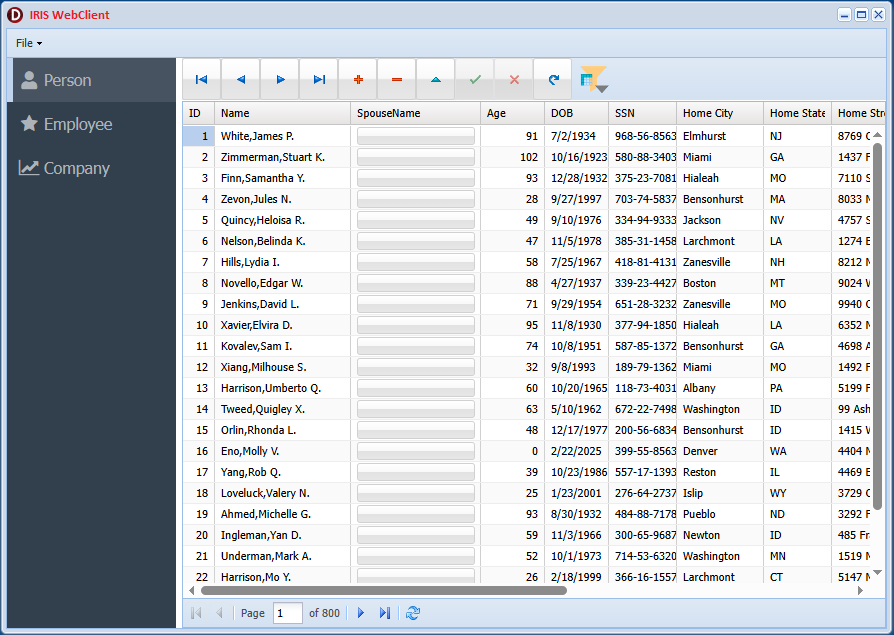

<h1>IrisWebClient</h1>

<b>Rich GUI Web Application for InterSystems IRIS</b>

A modern web client built with <b>Delphi + uniGUI</b> and connected to 
<b>InterSystems IRIS</b> via <b>ODBC</b>.  
The application demonstrates full <b>CRUD operations</b>, referential property handling, 
and IRIS-native filtering using implicit JOINs.

<h2>Features</h2>
<ul>
  <li><b>Full CRUD</b> (Create, Read, Update, Delete) for IRIS persistent classes</li>
  <li><b>Insert/update of referential properties</b> such as:
    <ul>
      <li>Person → Spouse</li>
      <li>Employee → Company</li>
    </ul>
  </li>
  <li><b>IRIS implicit JOIN filtering</b>:
    <ul>
      <li>Filter by nested referential fields</li>
      <li>Examples:
        <ul>
          <li>Person.Spouse.Name</li>
          <li>Employee.Company.Name</li>
          <li>Address.City</li>
        </ul>
      </li>
    </ul>
  </li>
  <li>Rich web UI built with uniGUI</li>
  <li>ODBC connectivity for SQL access to IRIS</li>
  <li>Zero-installation browser client</li>
</ul>

<h2>Architecture Overview</h2>
<ul>
  <li><b>Frontend:</b> uniGUI (Delphi)   https://unigui.com/ </li>
  <li><b>Backend:</b> InterSystems IRIS   https://www.intersystems.com/</li>
  <li><b>Connectivity:</b> IRIS ODBC driver</li>
  <li><b>Data Model:</b> Person, Employee, Company, Address (with referential relationships) <b>ObjectScript-Native-API-demo</b> 
  https://openexchange.intersystems.com/package/ObjectScript-Native-API-demo</li> 
</ul>

<h2>CRUD Demonstration</h2>

The application implements full CRUD for all major entities:

<table>
  <tr>
    <th>Entity</th>
    <th>Create</th>
    <th>Read</th>
    <th>Update</th>
    <th>Delete</th>
    <th>Referential Fields</th>
  </tr>
  <tr>
    <td>Person</td>
    <td>✔</td>
    <td>✔</td>
    <td>✔</td>
    <td>✔</td>
    <td>Spouse, Address</td>
  </tr>
  <tr>
    <td>Employee</td>
    <td>✔</td>
    <td>✔</td>
    <td>✔</td>
    <td>✔</td>
    <td>Company</td>
  </tr>
  <tr>
    <td>Company</td>
    <td>✔</td>
    <td>✔</td>
    <td>✔</td>
    <td>✔</td>
    <td>—</td>
  </tr>
</table>

<h2>Referential Property Handling</h2>

The application demonstrates how to:

<ul>
  <li>Insert and update objects with references</li>
  <li>Display referential fields in grids</li>
  <li>Resolve nested properties (e.g., Person.Spouse.Name)</li>
  <li>Maintain referential integrity through UI controls</li>
</ul>

<h2>Filtering with IRIS Implicit JOIN</h2>

IRIS automatically resolves referential properties in SQL queries.  
This application shows how to filter by nested properties without writing explicit JOINs.

<pre>
SELECT *
FROM ONAPI.Person
WHERE Spouse->Name LIKE 'A%'
</pre>

<h2>Installation</h2>

(To be expanded)

<ul>
  <li>Install IRIS</li>
  <li>Load sample classes</li>
  <li>Configure ODBC DSN</li>
  <li>Build and run the uniGUI application</li>
</ul>

<h2>Configuration</h2>

(To be expanded)

<h2>Screenshots</h2>

<b>Main Dashboard</b>
 

<!--
<h2>Roadmap</h2>
<ul>
  <li>REST API layer</li>
  <li>ZPM packaging</li>
  <li>Docker deployment</li>
  <li>Authentication module</li>
  <li>Additional referential examples</li>
</ul>
-->
<h2>License</h2>

MIT

